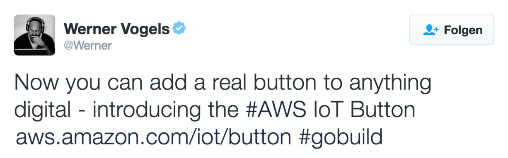
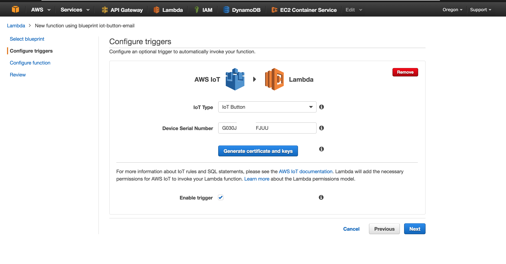
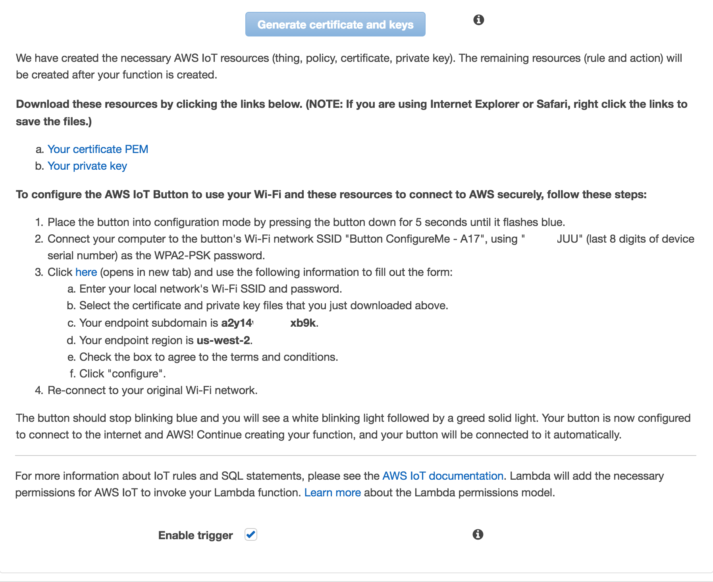
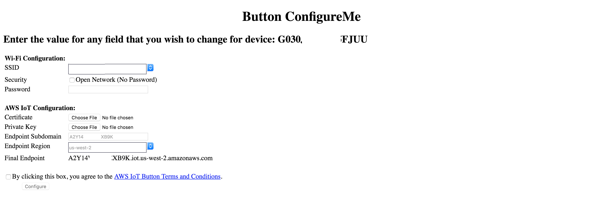
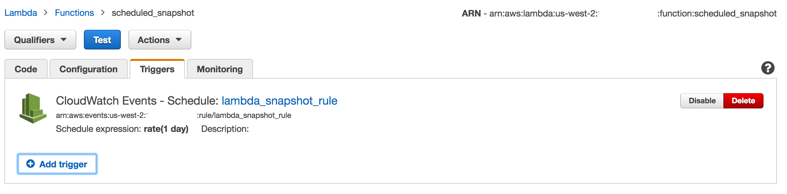
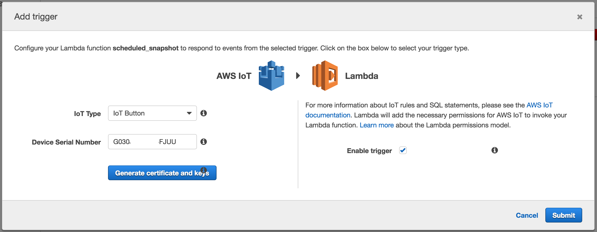
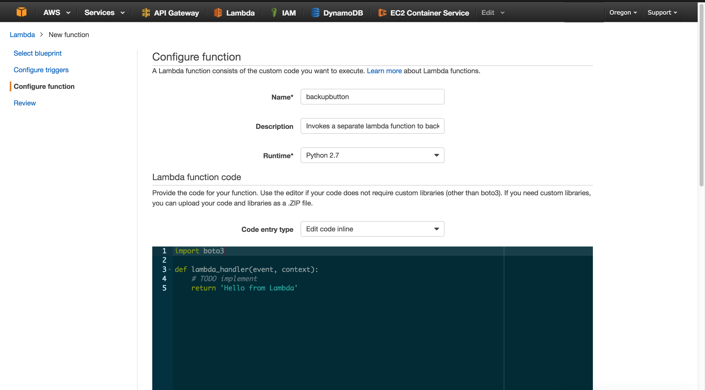
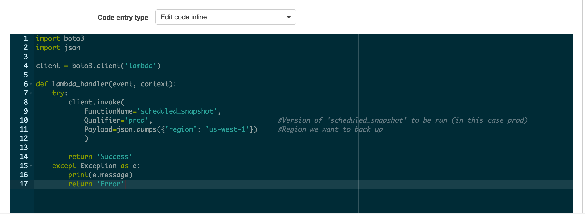

Today we're going to experiment with the AWS IoT to expand [our existing backup functionality]() with a physical backup button for our environment.

>**According to Amazon:** "The AWS IoT Button is a programmable button based on the Amazon Dash Button hardware. This simple Wi-Fi device is easy to configure and designed for developers to get started with AWS IoT, AWS Lambda, Amazon DynamoDB, Amazon SNS, and many other Amazon Web Services without writing device-specific code.

>You can code the button's logic in the cloud to configure button clicks to count or track items, call or alert someone, start or stop something, order services, or even provide feedback. For example, you can click the button to unlock or start a car, open your garage door, call a cab, call your spouse or a customer service representative, track the use of common household chores, medications or products, or remotely control your home appliances."




In the spirit of Werner's tweet, today we're going to #gobuild!

For our experiment, we will expand [our existing backup functionality]() with a physical backup button for our environment.


Usually regularly scheduled snapshots are enough, however, sometimes you need to manually back things up. To make it easy to perform an as-needed backup, we’ll use our IoT button.

Amazon has provided us with a configuration wizard for general use here: https://aws.amazon.com/iot/button.

The wizard opens this console:



Setting up the button is fairly straightforward, enter the Device Serial Number (DSN) and generate a certificate and keys. Follow the instructions to set up the button:





>**Note**: We could set up the IoT button and add it as a trigger to the existing snapshot function.
> 

>

>However, the existing implementation doesn’t know how to handle the button data (remember it’s designed to be called from Cloudwatch with the associated **event** data).

Rather than changing the existing implementation of the ***scheduled_snapshot*** lambda function, we’re going to create a new lambda function to invoke our existing function.

> **Note**: Although in this implementation we won’t handle the event data from the IoT button, its payload looks like this:
```
{
  'batteryVoltage': '1###mV',
  'serialNumber': 'G030ExampleFJUU',
  'clickType': 'SINGLE'|'DOUBLE'|'LONG'
}
```
 If desired, the **clickType** can be handled differently (e.g. different regions).

Now that the button is set up, it’s time to create our lambda function:



> **Note**: Some of the lambda set up details that were discussed in the [previous post]() will be glossed over.

The code for this new function is straightforward. The ***scheduled_snapshot*** function is going to be invoked using a payload that contains the desired backup **region** (in this case **us-west-1**).



That’s it for the code,
now onto permissions!
Because the ***backupbutton*** will be invoking ***scheduled_snapshot***, it needs a policy to reflect its function.
```
{
  "Version": "2012-10-17",
  "Statement": [
    {
      "Action": [
        "lambda:InvokeAsync",
        "lambda:InvokeFunction"
      ],
      "Effect": "Allow",
      "Resource": "arn:aws:lambda:us-west-1:acct-id:function:scheduled_snapshot"
    }
  ]
}
```
And ***that’s it***!

We now have a physical button that backs up our environment!

Now it's your turn: Get your button and #gobuild!
